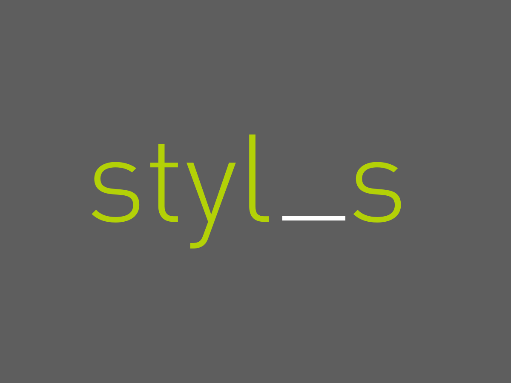

# davejmoz

**My personal website WordPress Theme Using Underscores & Stylus**

<!---->

### What is this?

This theme is an adaptation of [https://github.com/luclemo/Styl_s](an adaptation) of the bare bones starter theme, [Underscores (\_s)](http://underscores.me). It uses [Stylus](https://learnboost.github.io/stylus/) rather than Sass as a preprocessor, and I like that. So props [https://github.com/luclemo](Lucas).

###Why it's on Github

This is my first _real_ attempt at learning and using Github to create better products while continuing to learn new tools at the same time. So bear with me as I do the same :)
